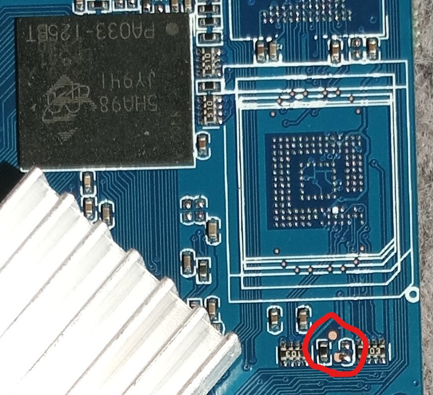
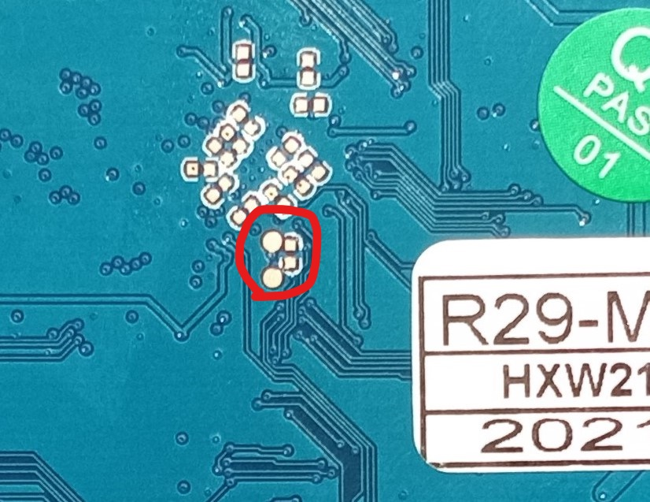
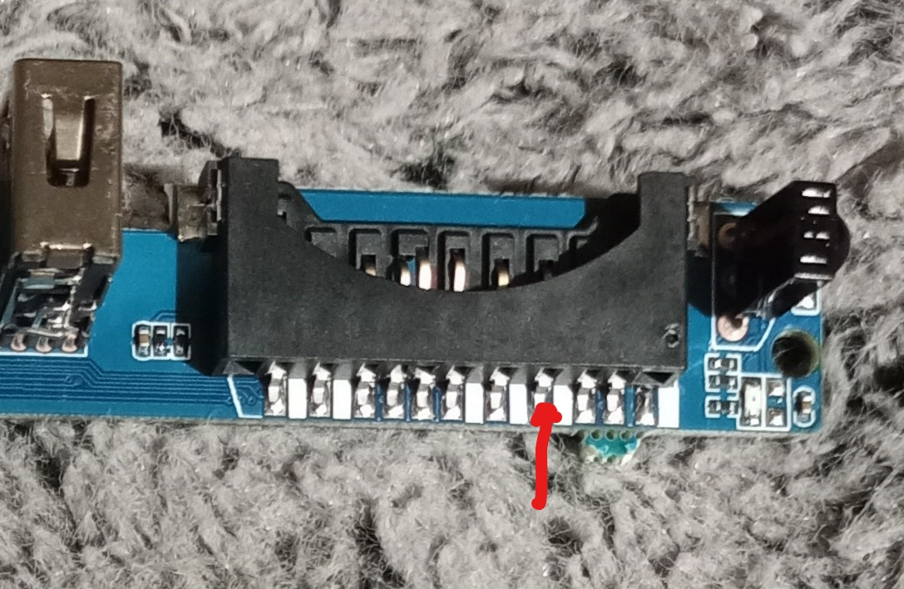

# R29-MXQ-LP3-V2.3-00908
RK3228(A) TV box teardown

Andoid 10.1 (real 7.X)

Kernel 3.10.104

WiFi RTL8723AS module.

Flash / RAM (probely fake) from reading with RK Android tool.  
```
Flash ID: 45 4d 4d 43 20
Manufactur SAMSUNG
Flash Size 7472MB
Total sectors: 0xe98000
Block size: 512KB
Page size: 2KB
ECC bits: 0
Access time: 40
Flash CS: 0
```
More real is MICRON 5HA98 JY941 (8GB eMMC eMMC 4.5, 1GB RAM Combo  Mem 256Mx8 NAND Flash + 32Mx32 LPDDR2 SDRAM 1.8V 162-Pin WFBGA)
(from old recycled Samsung Galaxy Grand Prime SM-G530H that waas relesed 2014). 
  
Installing  SSH helper and terminat in android and using this for dumping the device tree:
```
tar -zcvf  device.tar.gz /sys/firmware/devicetree/base/
```
No comport pads found only 2 pads for bootig in mask rom (is near one of the not mounted meory chips see photo) and on the under side near the CPU but not knowing what its for. I think the comport is on the SD-card conection but have not testing it.



I think (= have not testing) its the 4 contact from right and its pinnumber 5 then 9 is on the phased side and befor number 1 and is SCLK that is logic.

multitool and libreelec is booting OK but the HDMI not working.  
libreelec its possible adding "ssh" and can conecting with SSH.  
DMESG from boot of libreelec with rk3228a-box.dtb as config (no WiFi and no critical errors = very OK).  


Trying dunping with RK-dump but not working also with older derivers installed.  
RK_Android_Tool i can dooing dumps but its not 110% is OK.  
Parameters looks being red OK and i have making it more times. 
```
PARM  FIRMWARE_VER:7.0.0
MACHINE_MODEL: hx322x_box
MACHINE_ID:007
MANUFACTURER:RK30SDK
MAGIC: 0x5041524B
ATAG: 0x60000800
MACHINE: 3228
CHECK_MASK: 0x80
KERNEL_IMG: 0x60408000
#RECOVER_KEY: 1,1,0,20,0 
CMDLINE:console=ttyFIQ0 androidboot.selinux=permissive androidboot.hardware=rk30board androidboot.console=ttyFIQ0 init=/init mtdparts=rk29xxnand:0x00002000@0x00002000(uboot),0x00004000@0x00004000(trust),0x00002000@0x00008000(misc),0x00000800@0x0000A000(baseparamer),0x00007800@0x0000A800(resource),0x00006000@0x00012000(kernel),0x00006000@0x00018000(boot),0x00010000@0x0001E000(recovery),0x00020000@0x0002E000(backup),0x00040000@0x0004E000(cache),0x00008000@0x0008E000(metadata),0x00002000@0x00096000(kpanic),0x00400000@0x00098000(system),-@0x00498000(userdata)
»Ü‰¤                                                                                                                                                                                                                                                   
```
Shall testing dumping the flash from Linux.

Thinkin is i dont need the internal flash its also possible using SD-card and running ARMBian and if can patching one image file with libreelec boot and ARMBrian system it wold being great for running docker with RTL-433 and other good things.

#### ARMbian
After some test acn soudering i can comfirming the pads under the CPU is the snolle and the pads by the not mounted mameor chips is the fore MASKROM.  
Py playing around with mulltitool from local console is multitool not working OK then i an only see the warning messages and not to menues the program is having.
Was teting 8 +  enter and the box is rebooting = very good and testing more untill i see one messahe "/dev/mmcblk2 sucseful erased" and i have deleting the internal eMMC by misstake :((((  
  
Was trying flashing one new loader on the internal eMMC but it looks that  the box is not likeing them and was finding 2 that is working and one is much older then the orginal and the other only little. from Linux. After getting on installed the system is booting OK on external SD-card without having one bootloader and uboot.  
Bootit windows and trying RK anndroid tool and deleting the flash and flasing loaders and is getting some hard sotware bricks and need forcing madkrom with pads shutting for getting the box working. 
Loader that not working: rk322x_loader_v1.10.256.bin Working one: RK322XMiniLoaderAll_V2.47_spectek_en_ddr2_rd_odt_171127.bin.  
The box is very kinky with loader it having in loaded in the chip and most tools is not working OK also in Linux. 
  
Then having getting multiboots boot plus hidden partitation plus focal in one new after working i trying playing with focal and testing install bootloader in the eMMC and install armian on internal eMMC and its making one new /dev/mmcblk2p1 and copy the system i have booting.   
Rebooting and its booting without SD-Card !!  
Only bad thing is with is the system is 4.4GB and the eMMC is only little more then 7.3GB so after update the system its not so much space playing around with.  
Ater foryt OK boot runing rk322x-config and RK3228A is its possible eMMC (if not working put NAND in) emmc-hs200, ddr3-660 and led-config2. If eMMC is not working config NAND and rebooting nd rerun the tool and its working (orginal is both NAND and eMMC that is having problems with the hardware). After that the eMMC is always booting in highest speed (standard normaly degraded all the time). Then running  armbian-config and disabling loading the desctop and doing manual updated untill the system is OK and rebooting. Rebooting and from 
Ater foryt OK boot runing rk322x-config and RK3228A is its possible eMMC (if not working put NAND in) emmc-hs200, ddr3-660 and led-config2. If eMMC is not working config NAND and rebooting nd rerun the tool and its working (orginal is both NAND and eMMC that is having problems with the hardware). After that the eMMC is always booting in highest speed (standard normaly degraded all the time). Then running  armbian-config and disabling loading the desctop and doing manual updated untill the system is OK and rebooting. Rebooting and from armbian-config need disabling desktop loading then its back after update and can also unistalling all unsued desctop probral like open office and mail and so on. Restarting ans you is having one fiocla updated with mainlain kernel :-))  

